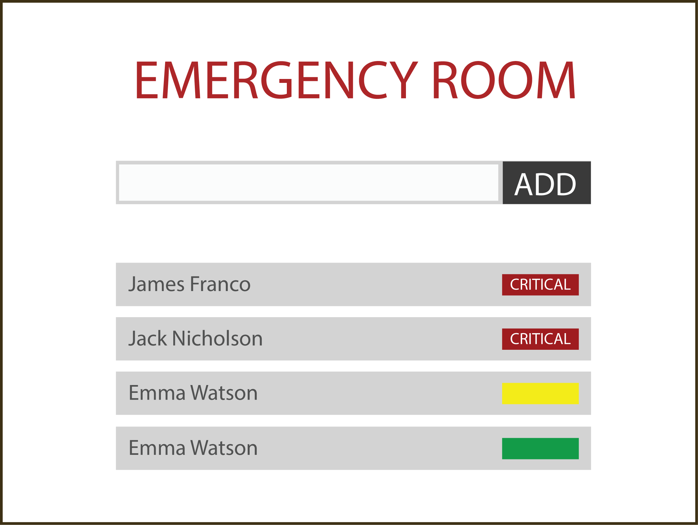

Summer Internship Challenge
===========================

Requirements
------------


### Install Git
```
# For linux users
$ sudo apt-get install git
```
Checkout this link to install Git on other platforms: [Install Git](https://git-scm.com/book/en/v1/Getting-Started-Installing-Git)


Clone the repository
--------------------

1. Ask someone from RedLight to create a new fork of this repository for yourself with the name **summerinternship-[your name]**

2. Clone the repository on your personal computer
```
$ git clone git@github.com:pcioga/summerinternship-[your name].git
```


Challenge
---------

RedLight focus have been focusing on Healthcare since some time ago.
One of your goals is to revolutionize how Healthcare services are provided to patients all around the world.

With this in mind, we will ask you to build a tiny Web Application to help doctors in an Emergency Room.

### Build a static web page

Here's a (extremely) simplified version of what a Web Application for an emergency room would look like.




Upload your work
----------------

When you're done, be sure to upload your work back to Github by committing directly to master.
